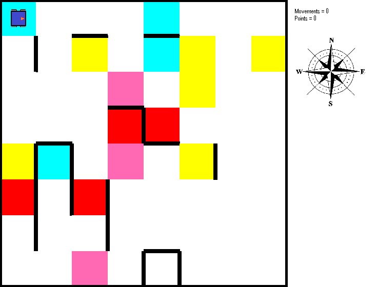

Última actualización: 24/10/2020

#


##
# **robotSim**

_ **robotSim** _ es un proyecto en desarrollo, así que le pedimos a los participantes de Candidates 2020 que estén atentos a cualquier aviso de actualización del programa. Igualmente, si hay cualquier duda no duden en contactarse con los programadores RoBorregos:

| Nombre | Correo | Github |
| ---- | ----- | ------ |
| José Cisneros | [A01283070@itesm.mx](mailto:A01283070@itesm.mx) | [@Josecisneros001](https://github.com/Josecisneros001) |
| Keven Arroyo | [A01283678@itesm.mx](mailto:A01283678@itesm.mx) | [@dake3601](https://github.com/dake3601) |
| Aurora Tijerina | [A01196690@itesm.mx](mailto:A01196690@itesm.mx) | [@AuroTB](https://github.com/AuroTB) |


### Acerca de este proyecto

El simulador fue adaptado específicamente para los retos de Candidates 2020. En esta versión, se tiene un entorno específico para el [Hack de Programación de Robótica 2020](https://drive.google.com/file/d/1B0jB0Iq4SKzmIq1SzM4XoDQHxFvHWOdm/view?usp=sharing).


### Uso del simulador

#### Correr programa localmente

1. Clonar el repositorio del proyecto.

	SSH:

	```bash
	$ git clone git@github.com:RoBorregos/robotSim.git
	```

	o HTTPS:
	```bash
	$ git clone https://github.com/RoBorregos/robotSim.git
	```

2. Entrar al directorio del proyecto.

	```bash
	$ cd robotSim
	```

3. Instalar dependencias del simulador.
	
	```bash
	$ pip install -r requirements.txt
	```

3. Codificar movimientos del robot en main\_program.py

4. Simular Programa 
	```bash
	$ python robotsim.py
	```
#### Correr online en Repl.it

1. Entrar a https://repl.it/languages/pygame
2. Copiar todos los archivos del repositorio en el env
3. Poner comando en terminal: python robotsim.py 


### Información Archivos 
El repositorio tiene los siguientes archivos en un folder:

- **main\_program.py:** script donde se programan los movimientos del robot
- **map.json:** descripción del mapa, sirve como entrada para que el programa genere la imagen
- **map.py y robotsim.py:** building class para el objeto mapa y script de inicialización y actualización del entorno.
- **imágenes del programa:** imágen del robot y del botón de play (run.png y robot.png).

Para correr el programa, símplemente se debe de correr el comando:
```bash
	$ python robotsim.py
```


### Mapa



El mapa cuenta con las siguientes características:

- Dimensiones de 8x8
- Paredes alrededor de todo el perímetro a recorrer
- Líneas negras: Edificios/estructuras urbanas
- Zonas rojas: Personas
- Zonas cyan: Safe zones
- Zonas rosas: Zona de derrumbe/peligro
- Zona amarilla: Incendio
- Contadores:
	- Movimientos
	- Puntos (de acuerdo a la rúbrica descrita en la descripción del Hack de programación)

Cabe recalcar que el robot **siempre** empezará en la base de bomberos (coordenada 0,0) viendo hacia el **ESTE** (derecha) de acuerdo a la rosa de los vientos.  
Igualmente, después de 300 movimientos el programa se terminará.


### Funciones del robot

| **Función** | **Descripción** | **Input/Output** |
| --- | --- | --- |
| robot.move\_forward() | Mueve el robot a la baldosa de enfrente | - |
| robot.rotate\_right() | Gira el robot 90° a la derecha | - |
| robot.rotate\_left() | Gira el robot 90° a la izquierda | - |
| robot.ultrasonicFront() | Obtiene la distancia (número de cuadrantes libres) frente al robot | Output: int |
| robot.ultrasonicRight() | Obtiene la distancia (número de cuadrantes libres) a la derecha del robot | Output: int |
| robot.ultrasonicLeft() | Obtiene la distancia (número de cuadrantes libres) a la izquierda del robot | Output: int |
| robot.detectFireFront() | Regresa si la baldosa enfrente del robot tiene o no fuego. | Output: bool |
| robot.scanEnvironment() | Regresa el tipo de ambiente en el que se encuentra el robot: "fire", "people", "collapse", "clear", "safe" | Output: string |
| robot.putOutFireFront() | Apaga el fuego en la baldosa que está enfrente del robot. | - |
| robot.sendMessageExplorationBase(Coord) | Envía coordenadas a la base de exploración | Input: obj Coord <br/>Output: bool |
| robot.sendMessageRescueBase(Coord, path) | Envía coordenadas a la base de rescate y (opcionalmente) un path a una zona segura. El path debe tener la forma de una lista de caracteres hacia las direcciones de acuerdo a la rosa de los vientos: <br/>-N: Norte (North) <br/>-S: Sur (South) <br/>-E: Este (East) <br/>-W: Oeste (west) <br/>Ejemplo: <br/>[‘N’, ‘E’, ‘S’, ‘S’, ‘W’] | Input: obj Coord, (opcional) lista de direcciones a seguir <br/>Output: true |
| robot.finishExploration() | Termina la simulación. Si se realiza esta función sobre la coordenada 0,0 el robot habrá regresado a la base y se agregan 20 puntos al contador. | Output: simulación termina. |


### Importante

Cuando se escriba código en main\_program.py se tienen que tomar en cuenta los siguientes detalles:

- Todo el código debe realizarse dentro de la función main()
- Si creas una función, de debe colocar como una función anidada
- Si se declara una variable, debe declararse dentro de main().

Con suerte, esto se puede solucionar en el futuro, pero por el momento se debe de realizar así para evitar que el programa tenga errores.

Si se identifica cualquier bug por favor manden mensaje a los organizadores de Candiates 2020.
